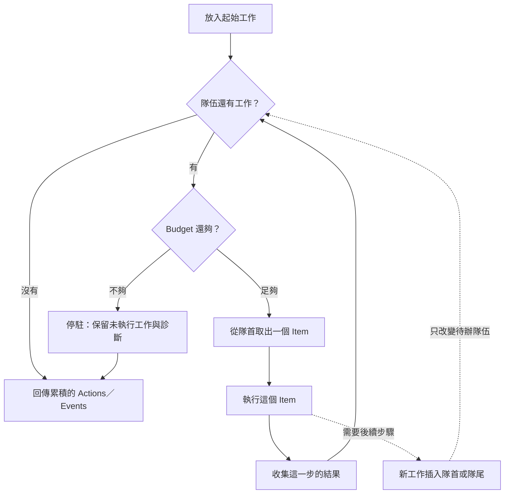
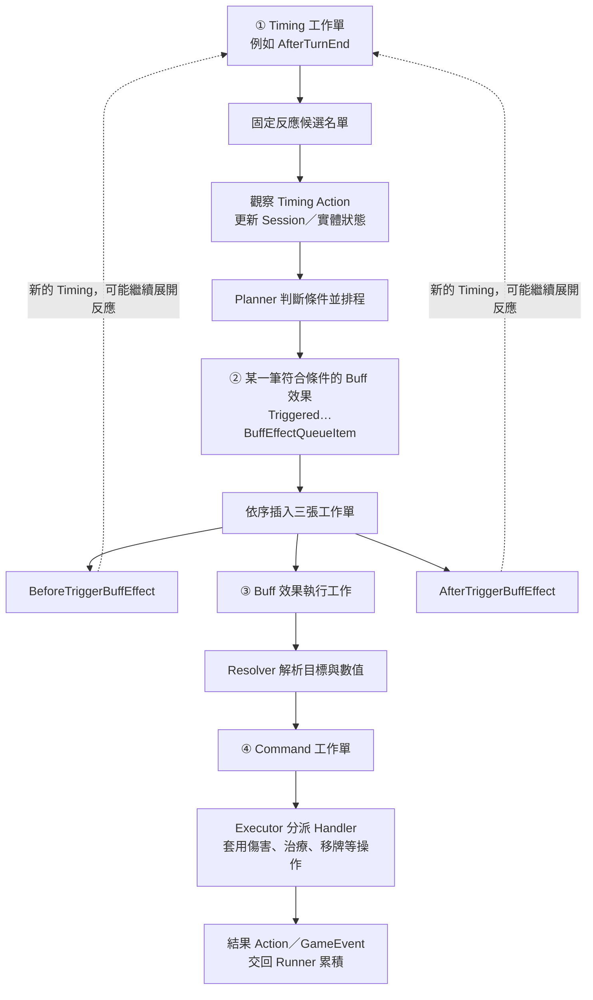
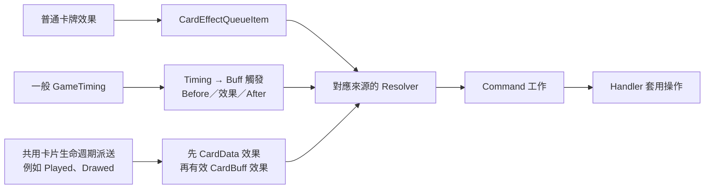

# Effect Queue 觸發循環圖解

> 核對日期：2026-09-20  
> 用途：隔一段時間回來時，快速重建對排程與連鎖的理解。  
> 本文解釋運作方式；來源能力與領域規則以 [Effect](Effect.md)、[Card](Card.md) 為準。

## 先記住這個畫面

**一個工作人員，面前有一條待辦隊伍。每次只拿一張工作單；這張工作單可能完成事情，也可能再拆出幾張工作單。**

| 程式名稱 | 想像成 | 責任 |
|---|---|---|
| EffectQueueRunner | 工作人員 | 取出工作、執行、收集結果，直到隊伍清空或預算耗盡 |
| EffectQueueItem | 工作單 | 定義這一步要做什麼，以及要排入什麼後續工作 |
| Queue | 待辦隊伍 | 保存尚未執行的工作及其順序 |
| Enqueue | 排到隊尾 | 既有工作先做 |
| EnqueueImmediate | 插到隊首 | 目前這一步結束後，優先做新工作 |
| EffectResult | 完成紀錄 | 本步產生的結果 Action 與畫面 Event |

**Immediate 表示「下一步優先」，不是「現在立刻呼叫新工作的 Execute」。** 排入與執行是兩件事，這是閱讀整套流程最重要的區分。

## 圖一：Runner 永遠只做同一個循環



實線是 Runner 的主流程；虛線表示 Item 執行期間可以修改待辦隊伍。插入之後仍須先完成目前 Item，再回到主循環。

Runner 不需要知道「這是回合結束還是傷害」。它只知道目前的工作單可以執行。Budget 計算的是執行過的 Item 數，不是卡牌數、傷害次數或動畫數。

這張圖描述正常執行與預算停駐；一般程式例外仍會向呼叫端傳遞，不會自動變成成功結果。預算停駐也不會回滾先前已完成的狀態變更。

來源：[EffectQueueRunner](../Assets/Scripts/GameModel/Effect/EffectQueueRunner.cs)。

## 圖二：工作如何從「時機」拆到「真的扣血」

以下聚焦一般 GameTiming 觸發 Buff 的路徑。**圖中的展開箭頭表示產生工作，並不表示每一步都在同一次呼叫裡做完。**



三張工作的順序是 **Before → 效果 → After**，不是平行執行。某張工作若再展開子工作，子工作會先做，之後才輪到後面的工作。

可以把四種工作分成四個問題：

| 層次 | 它回答的問題 | 本步的主要產出 |
|---|---|---|
| Timing | 這個時機有哪些反應符合條件？ | 一批反應工作 |
| Buff 觸發 | 這一筆 Buff 效果需要哪些前後步驟？ | Before、效果、After |
| Effect | 依現在的目標與數值，要做哪些操作？ | 一批 Command 工作 |
| Command | 這個操作實際造成什麼變化？ | 狀態變更、結果與事件；必要時也排入後續工作 |

**工作單不等於一次傷害。** 很多 Item 只負責展開後續工作，回傳空結果仍然是正常且有用的一步。抽牌等操作也可能再拆成逐張處理，不必強行套成「一個 Command 一次修改」。

一般 Timing 的候選名單先固定，再更新 Session／實體，接著 Planner 建立計畫。候選保存的是實體參考，不是整份遊戲狀態的深度複本；不要把快照理解成後續數值全部凍結。計畫先排 PlayerBuff、CharacterBuff、CardBuff 的一般反應，再排形態轉換工作。

來源：[BuffTimingQueueItems](../Assets/Scripts/GameModel/Effect/BuffTimingQueueItems.cs)、[TimingDispatchPlanner](../Assets/Scripts/GameModel/Effect/TimingDispatchPlanner.cs)。

## 圖三：看隊伍變化，比追呼叫鏈容易

假設某次 Timing 已排入 A、B 兩筆 Buff 效果。A 造成傷害，B 獲得護盾；這個示例省略形態工作，並假設 Before／After 都沒有其他反應。

**以下每列都是該步完成後的待辦隊伍，左邊最先執行。**

| 步驟 | 剛完成的事 | 待辦隊伍：隊首 → 隊尾 |
|---|---|---|
| 0 | Timing 已排入符合條件的反應 | `A 觸發` → `B 觸發` |
| 1 | A 觸發展開前後步驟 | `A Before` → `A 效果` → `A After` → `B 觸發` |
| 2 | A Before 沒有衍生工作 | `A 效果` → `A After` → `B 觸發` |
| 3 | A 效果解析出傷害命令 | `A 傷害命令` → `A After` → `B 觸發` |
| 4 | 傷害命令實際扣血並回傳結果 | `A After` → `B 觸發` |
| 5 | A After 沒有衍生工作 | `B 觸發` |
| 6 | B 開始展開自己的三步 | `B Before` → `B 效果` → `B After` |

步驟 3 尚未扣血；步驟 4 才由 Handler 套用傷害。A 效果產生的傷害命令會插在 A After 前面，所以 After 發生時，A 的效果已處理過。

### 如果 A Before 又觸發 C？

假設只有 A Before 符合 C 的反應條件，其餘新時機不再觸發它：

```text
準備執行 A Before：
[A Before] [A 效果] [A After] [B 觸發]

A Before 展開 C：
[C 觸發] [A 效果] [A After] [B 觸發]

C 觸發展開自己的步驟：
[C Before] [C 效果] [C After] [A 效果] [A After] [B 觸發]

C 的所有立即衍生工作完成後：
[A 效果] [A After] [B 觸發]
```

這形成深度優先的處理順序：**先處理目前工作立即衍生的分支，再回到原本排在後面的工作。** 若資料讓 C 在每個 Before 都再次觸發 C，就可能不斷展開，最後由 Budget 停駐。

這裡的分支仍在同一 Runner 內；不是每觸發一個 Buff 就建立新的 Runner。

## 插隊順序的小抄

假設 X 已取出，剩餘隊伍為 `[Y] [Z]`，X 想新增 A、B：

| X 的排程方式 | X 結束後的隊伍 |
|---|---|
| A、B 依序 Enqueue | `[Y] [Z] [A] [B]` |
| 以一批 `[A, B]` EnqueueImmediate | `[A] [B] [Y] [Z]` |
| 先單獨 Immediate A，再單獨 Immediate B | `[B] [A] [Y] [Z]` |

批次 Immediate 會保留該批順序；連續單筆插到隊首則會反轉。這也是某些呼叫端反向走訪清單的原因：它想保留最後真正執行的順序。

## 三種入口，不必都從 Timing 開始



這是入口關係圖，不表示每個入口一定建立新 Runner。入口可將工作加入既有 Runner，或由呼叫端建立 Runner 執行。

普通卡牌效果直接開始解析；一般 GameTiming 的 Buff 反應才使用前述三步包裝。共用卡片生命週期派送目前直接建立 CardData／CardBuff 效果執行工作，**不會自動套上一般 Buff 的 Before／After 包裝**。

FormChanged 仍有專用路徑，EffectPlayed 尚無正式間接出牌入口；完整接線範圍見 [Card](Card.md)，不要由列舉或類別名稱推論。

來源：[CardTriggeredEffectDispatch](../Assets/Scripts/GameModel/Effect/CardTriggeredEffectDispatch.cs)。

## 執行順序、觀察與畫面是不同的事

以傷害 Handler 為例：先套用傷害，建立 Result Action，透過 ObserveDerivedAction 更新相關 Session／實體，再回傳包含 DamageEvent 的結果。

ObserveDerivedAction 不會自動把所有符合結果的 Buff 都執行一遍；一般 Buff 效果由 Timing 派送路徑排程。Result Action 是規則觀察資料，GameEvent 是畫面更新資料，兩者也不是新的 QueueItem。

Runner 收集 GameEvent，不在這個循環內等待動畫。呼叫端取得結果後才交給呈現流程。**「效果已執行」與「動畫已播放完」不能畫成同一條同步等待鏈。**

來源：[Damage Handler](../Assets/Scripts/GameModel/Effect/Handlers/DamageEffectCommandHandler.cs)、[GameplayManager](../Assets/Scripts/GameModel/GameplayManager.cs)、[GameView](GameView.md)。

## 分清楚一個 Runner 與一次完整出牌

同一 Runner 的工作共用 Budget；靜態 RunToCompletion 每次建立新 Runner 與新預算。因此目前一次完整出牌可以先後使用多個 Runner，例如不同次普通效果重複、Played 與一般 Timing 根入口。

**單個 Runner 有連鎖保護，不等於整次出牌或整條間接出牌鏈已有共同保護。** 現況與後續範圍集中於 [Effect 的排程與預算](Effect.md#排程與預算)。

## 下次忘記時，照這個順序找回來

先看「圖一」想起唯一的取件循環，再看「圖三」想起子工作如何插隊。閱讀某個 Item 時只問：

1. 這一步直接改變了什麼？還是只產生工作？
2. 它排入哪些工作，放隊首還是隊尾？
3. 它回傳哪些結果，哪些事情仍未執行？

| 想確認的問題 | 程式入口 |
|---|---|
| Runner 怎麼取件、計數、累積結果？ | [EffectQueueRunner](../Assets/Scripts/GameModel/Effect/EffectQueueRunner.cs) |
| 一般 Buff 怎麼展開 Before／效果／After？ | [BuffTimingQueueItems](../Assets/Scripts/GameModel/Effect/BuffTimingQueueItems.cs) |
| 哪些反應符合條件，先排誰？ | [TimingDispatchPlanner](../Assets/Scripts/GameModel/Effect/TimingDispatchPlanner.cs) |
| 卡片生命週期怎麼加入同一套 Queue？ | [CardTriggeredEffectDispatch](../Assets/Scripts/GameModel/Effect/CardTriggeredEffectDispatch.cs) |
| 效果怎麼變成命令？ | [EffectDataResolver](../Assets/Scripts/GameModel/Effect/EffectDataResolver.cs) |
| 哪裡真的改變狀態？ | [EffectCommandExecutor](../Assets/Scripts/GameModel/Effect/EffectCommandExecutor.cs) 與 [Handlers](../Assets/Scripts/GameModel/Effect/Handlers/) |
| 本段工作沿用 Runner 還是建立新的？ | 追查 [GameplayManager](../Assets/Scripts/GameModel/GameplayManager.cs) 等呼叫端 |

Context 的 Source、Triggered、Selected 視角另見 [Action](Action.md)。先理解隊伍順序，再加入視角與條件，較不容易同時陷入兩種問題。
